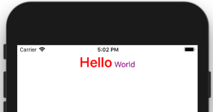

# SimpleString

Used to simply style strings in iOS applications with the least amount of friction possible.

## Example

```swift
let text: NSAttributedString =
            "Hello".attributedString
                .font(with: UIFont.boldSystemFont(ofSize: 32))
                .colored(.red)
                +
            " World".attributedString
                .font(with: UIFont.systemFont(ofSize: 18))
                .colored(.purple)
        
label.attributedText = text.align(.center)

```


## Available APIs

```swift
// Styling a string
let text: NSAttributedString =
            "SimpleString".attributedString // Convert string to attributed string
                .font(with: UIFont.systemFont(ofSize: 24)) // UIFont
                .colored(.orange) // UIColor
                .align(.center) // NSTextAlignment
                .lineBreakMode(.byWordWrapping) // NSLineBreakMode

// Combining attributed strings            
let firstText: NSAttributedString = ...
let secondText: NSAttributedString = ...
let combinedText: NSAttributedString = firstText + secondText
```

## Installation

### Cocoapods

Add to your `Podfile`

```rb
pod 'SimpleString'
```

Then run `pod install`.

### Carthage

Add to your `Cartfile`

```
github "pangers/SimpleString"
```

Then run `carthage update`.

## Licence

SimpleString is released under an MIT license. See [License.md](License) for more information.